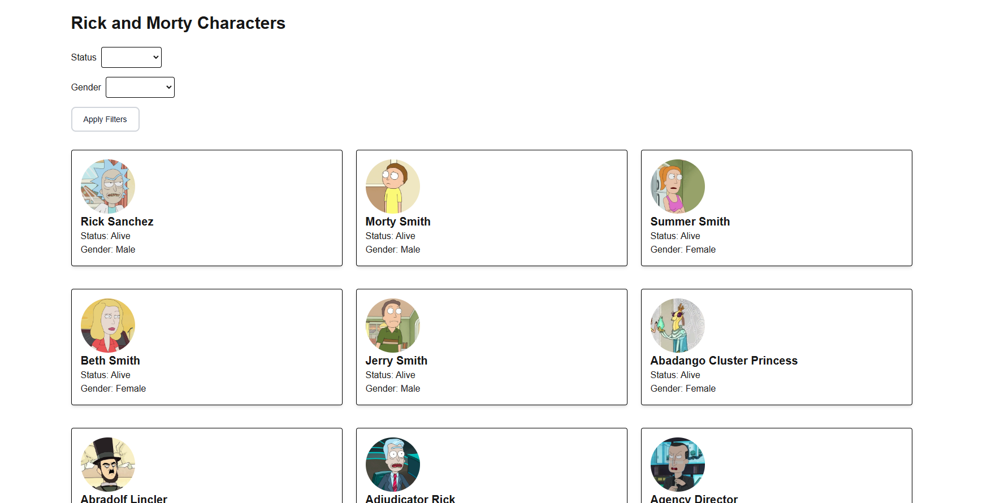
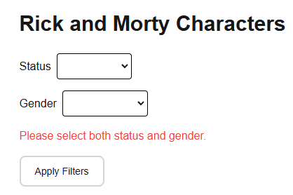
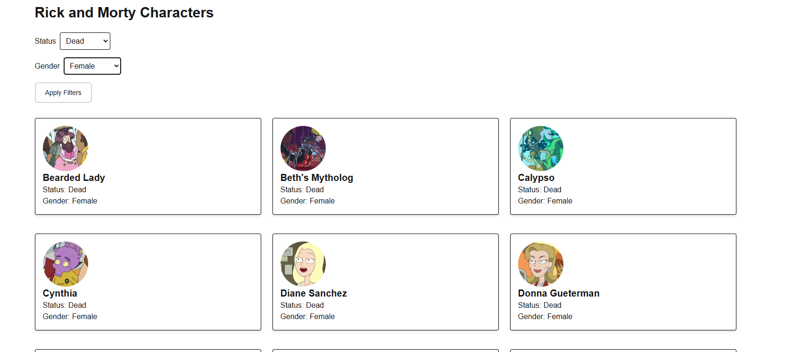

# Rick and Morty Karakter Listesi ve Filtreleme





Bu proje, Rick and Morty karakterlerini listeler ve kullanıcılara karakterleri filtreleme imkanı sağlar. Karakterler, durum (status) ve cinsiyet (gender) gibi filtreler kullanılarak listelenebilir. Kullanıcıların her iki filtreyi (status ve gender) seçebileceği ve entegre bir şekilde çalışacağı garanti edilmiştir.

## Kullanılan Teknolojiler

- **Next.js** (SSR - Sunucu Tarafı Render)
- **Tailwind CSS** (Özelleştirilmiş stil ve tasarım)
- **TypeScript** (Tip güvenliği)

## Nasıl Çalışır?

Bu proje, **Next.js** kullanılarak geliştirilmiştir ve **SSR (Sunucu Tarafı Render)** olarak yüklenir. Kullanıcılar, karakterleri **durum** (alive, dead, unknown) ve **cinsiyet** (male, female, unknown) gibi filtrelerle filtreleyebilir. Her iki filtre birbirini entegre bir şekilde çalıştırır, yani bir filtreyi seçtiğinizde diğer filtreyi de etkiler ve her iki seçeneği aynı anda kullanabilirsiniz.

### Filtreleme Özellikleri:

- **Durum Seçeneği (Status)**: Karakterin hayatta olup olmadığını belirler.
  - Alive
  - Dead
  - Unknown

- **Cinsiyet Seçeneği (Gender)**: Karakterin cinsiyetini belirler.
  - Male
  - Female
  - Unknown

### Filtreleme İntregasyonu:
- Hem **Alive** hem de **Male** seçeneklerini aynı anda seçebilirsiniz. Filtreler birbirini etkilemez ve aynı anda çalışırlar.
- Eğer bir filtreyi seçmeden formu göndermeye çalışırsanız, kullanıcıya bir hata mesajı gösterilir: 
  - **"Lütfen tüm seçenekleri seçtiğinizden emin olun."**

### Varsayılan Sayfa:
- `http://localhost:3000/` adresi doğru çalışmamaktadır. Lütfen belirtilen adrese gidin ve filtreleme seçeneklerini kullanarak karakterleri görüntüleyin.

## Kurulum

Bu projeyi yerel ortamınızda çalıştırmak için aşağıdaki adımları izleyebilirsiniz:

1. **Projeyi klonlayın:**

   ```bash
   git clone https://github.com/username/rick-and-morty-characters.git
